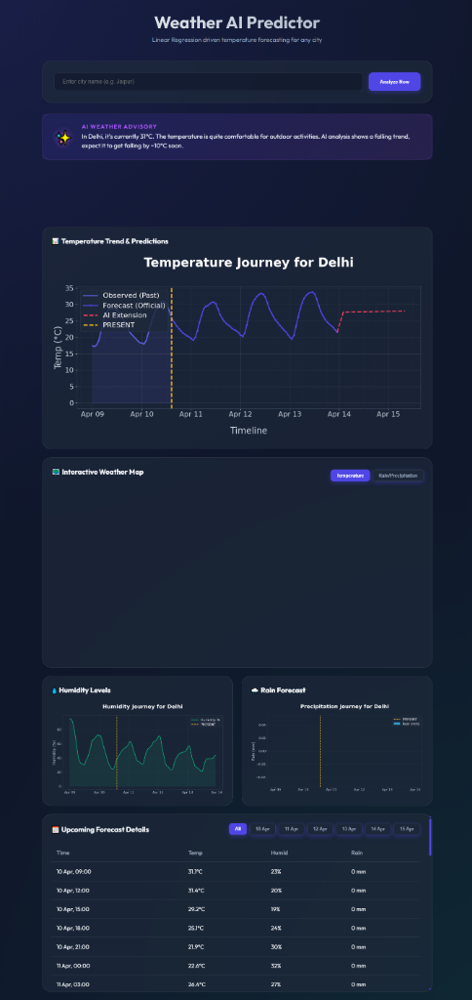

# 🌦️ AI-Based Weather Forecasting System



A professional, high-fidelity weather analytics dashboard that combines **Real-Time API Data** with **Machine Learning Predictions** to provide a comprehensive weather journey.


## 🚀 Key Features

### 1. **Interactive AI Dashboard**
- **Modern Aesthetics**: A stunning dark-mode Glassmorphism UI built with vanilla CSS.
- **Smart Advisory**: Heuristic AI engine that provides personalized weather tips (e.g., "Carry an umbrella," "Great for outdoor activities").

### 2. **Professional Visualizations (11-Day Journey)**
- **High-Resolution Charts**: Massive, detailed graphs for **Temperature, Humidity, and Rain**.
- **Time-Wise Precision**: Analytical charts featuring **6-hour minor gridlines** and **Ultra-Clear text** for maximum readability.
- **Present-Time Tracking**: A golden "Present Time" vertical line helps you instantly identify where you are in the 11-day timeline.

### 3. **Machine Learning Trends**
- **AI Trend Extension**: Uses **Scikit-Learn's Linear Regression** to analyze current trends and project future temperature paths (AI Extension).
- **Historical Context**: Integrates data from the past 4 days with future forecasts for a complete environmental context.

### 4. **Smart Data Management**
- **Interactive Filtering**: Filter the "Upcoming Forecast Details" table by specific dates using an interactive tab system.
- **Scrollable Insights**: Managed UI components with scrollable containers to keep the dashboard compact and efficient.

### 5. **Interactive Mapping**
- **Leaflet.js Integration**: Dynamic weather maps with toggleable layers for **Temperature** and **Precipitation (Rain)**.
- **Live Geodata**: Real-time city search with coordinates-based mapping.

## 🛠️ Tech Stack
- **Frontend**: HTML5, Vanilla CSS (Glassmorphism), JavaScript (Leaflet.js).
- **Backend**: Flask (Python).
- **Data Science**: Pandas, NumPy, Scikit-Learn.
- **Visualization**: Matplotlib (Custom Dark Theme).
- **APIs**: OpenWeatherMap (Current/Forecast), Open-Meteo (Historical/Extended).

## ⚙️ Setup & Installation

1. **Clone & Navigate**:
   ```bash
   cd "Weather app"
   ```

2. **Initialize Environment**:
   ```bash
   python -m venv venv
   venv\Scripts\activate
   ```

3. **Install Dependencies**:
   ```bash
   pip install -r requirements.txt
   ```

4. **Launch**:
   ```bash
   python app.py
   ```
   Visit `http://127.0.0.1:5000` to experience the dashboard.

## 👤 Project Structure
- `app.py`: Flask core with ML logic, Data Fetchers, and Graph Plotters.
- `templates/index.html`: The main dashboard UI with interactive JS components.
- `requirements.txt`: Python package manifest.

---
*Created with ❤️ for precision weather enthusiasts.*
